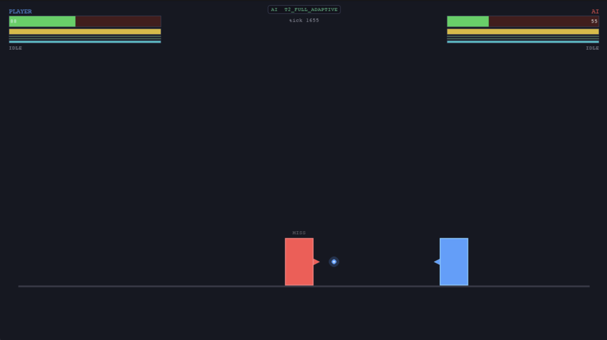
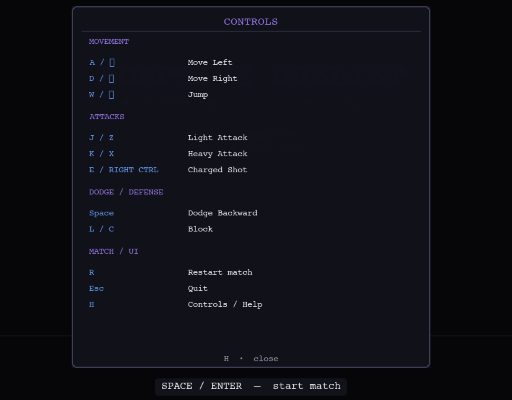
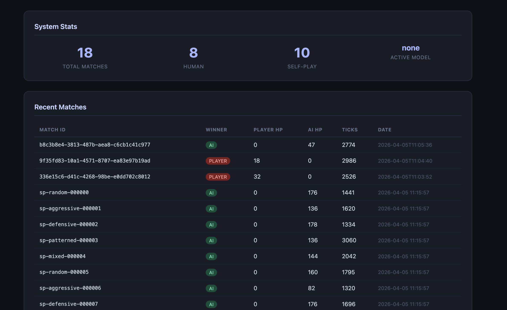

# Adaptive Duelist AI

A 1v1 combat sandbox where an AI opponent learns your playstyle, predicts your next move, and adapts its strategy in real time — all running locally with a full ML training pipeline, deterministic replay system, and REST API.



---

## Why This Project Is Interesting

Most "adaptive AI" in games is scripted difficulty scaling. This one is different:

- **Real machine learning in the game loop.** A Random Forest ensemble (Markov + sklearn) predicts your next combat commitment every tick. Prediction confidence drives tactical mode selection — the AI doesn’t just react, it tries to anticipate.
- **Full self-contained pipeline.** The same project that runs the game also handles data collection, model training, holdout evaluation, baseline snapshots, regression detection, and model promotion — all from the CLI.
- **Deterministic by seed.** Every match is replayable. Replay files record per-tick checksums; a replay audit tool verifies bit-for-bit consistency.
- **Three auditable tiers.** Swap between a random baseline (T0), Markov-only prediction (T1), and the full adaptive system (T2) at the title screen.
- **Sub-pixel integer physics.** No floating-point position math. Positions are stored as `pixels × 100` for exact reproducibility.
- **1,000+ passing tests.** Covers FSM transitions, physics, training pipeline, API, and full match simulations.

---

## Table of Contents

1. Quick Start  
2. Controls  
3. Features  
4. AI Tier System  
5. Session Adaptation  
6. Local API & Dashboard  
7. CLI Tools  
8. Training Pipeline  
9. Evaluation & Regression Gates  
10. Database Maintenance  
11. Project Architecture  
12. Roadmap  
13. Contributing  

---

## Quick Start

```bash
git clone https://github.com/mutwalli/adaptive-duelist-ai.git
cd adaptive-duelist-ai
python3 -m venv venv && source venv/bin/activate
pip install -r requirements.txt

python3 main.py
```

Run API + dashboard:

```bash
python3 scripts/run_api.py
```

Open:
```
http://localhost:8000/ui/
```

Run tests:
```bash
python3 -m pytest
```

---

## Controls



| Action | Keys | Notes |
|--------|------|-------|
| Move Left | `A` / `←` | |
| Move Right | `D` / `→` | |
| Jump | `W` / `↑` | |
| Light Attack | `J` / `Z` | Fast, low damage |
| Heavy Attack | `K` / `X` | Slow, high damage; cooldown |
| Charged Shot | `E` / `Right Ctrl` | Hold to charge, release to fire |
| Dodge Backward | `Space` | Has cooldown |
| Block | `L` / `C` | Guard meter; can break |
| Controls overlay | `H` | Pauses game |
| Restart match | `R` | End screen only |
| Quit | `Esc` | |
| Hitbox debug | `F1` | Debug overlay |

---

## Features

### Combat & Gameplay

- Fixed-timestep simulation (60 ticks/sec)
- Sub-pixel integer physics (`pixels × 100`)
- Full FSM combat system (attacks, dodge, block, airborne states)
- Jump system with gravity + landing
- Guard system with break and stun
- Charged projectile weapon
- Combo system with visual feedback
- Hitstop, screen shake, particles, attack trails
- Hitbox debug overlay

---

### Adaptive AI

- **T0** — Random baseline  
- **T1** — Markov prediction  
- **T2** — Full adaptive AI (ML + planner + session memory)

- Tactical modes: exploit, bait, defend, probe, punish  
- Player archetypes: AGGRESSIVE, DEFENSIVE, PATTERNED, EVASIVE, BALANCED  
- Adapts across matches without retraining  

---

### Training Pipeline

- Self-play data generation
- Curriculum-based training
- Random Forest model training
- Automated retrain → evaluate → promote loop

---

### Evaluation & Regression

- Headless simulation evaluator
- Frozen baseline snapshots
- Regression gates (pass/fail)
- Replay verification system

---

## Local API & Dashboard

```bash
python3 scripts/run_api.py
```

Open:
```
http://localhost:8000/ui/
```



Includes:
- match stats
- recent matches
- training pipeline control
- model registry
- evaluation tools

---

## CLI Tools

```bash
python3 scripts/cli.py <command>
```

Key commands:

| Command | Description |
|--------|-------------|
| play | Run the game |
| api | Start API server |
| self-play | Generate training data |
| train-promote | Retrain and promote model |
| evaluate | Run evaluation |
| curriculum | Adaptive training loop |
| model-status | View models |
| session-status | View AI adaptation |

---

## Training Pipeline

```bash
python3 scripts/cli.py self-play --matches 50
python3 scripts/cli.py train-promote --auto-promote
```

Supports:
- human data
- self-play data
- filtered training

---

## Evaluation

```bash
python3 scripts/cli.py evaluate --tier 2
python3 scripts/cli.py create-baseline
python3 scripts/cli.py check-regression
```

---

## Project Architecture

```
game/         simulation + combat
ai/           ML + planning + training
rendering/    visuals + HUD
api/          FastAPI backend
ui/           dashboard frontend
evaluation/   benchmarking
data/         database + logging
tests/        full test suite
```

---

## Roadmap

- Online learning during matches  
- Multiplayer / networked play  
- More combat mechanics (air attacks, cancels)  
- Replay viewer UI  
- Model export (ONNX)  

---

## Contributing

- Run tests before PRs: `python3 -m pytest`
- Maintain deterministic simulation
- Do not break regression gates
- Session memory stays in-process (not persisted)
