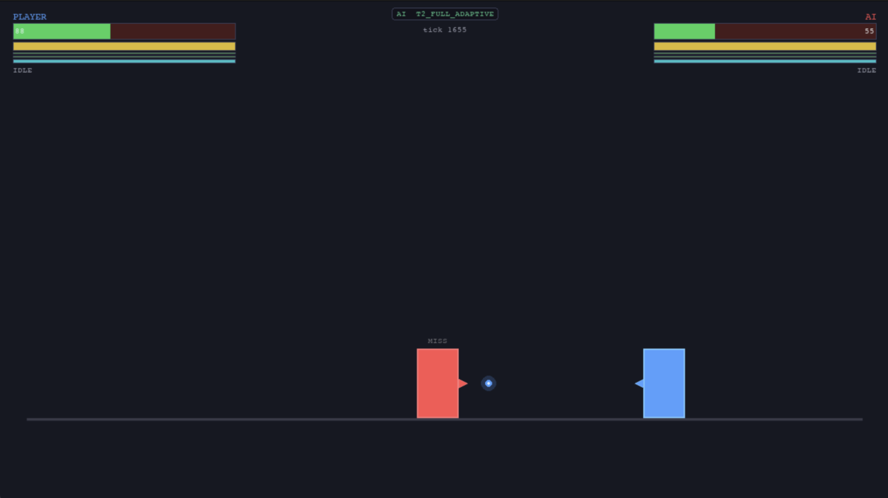
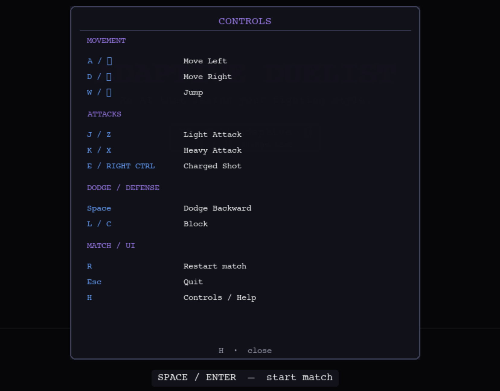
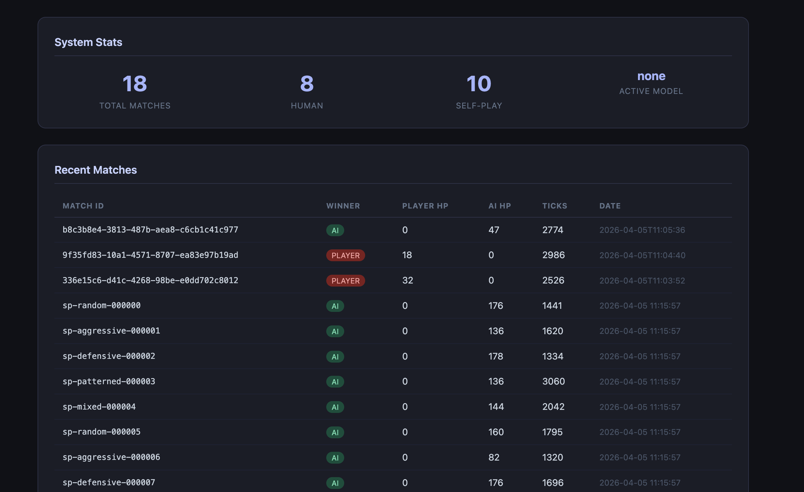

# Adaptive Duelist AI

A 1v1 combat sandbox where an AI opponent learns your playstyle, predicts your next move, and adapts its strategy in real time — all running locally with a full ML training pipeline, deterministic replay system, and REST API.



---

## Measured Results

Three-tier ablation run through the project's own evaluator
(`python3 scripts/cli.py evaluate --tier N --matches 400 --seed 0`).
**400 headless matches per tier, seeds 0–399, the same seed set for all three
tiers, and the same opponent in all three** — a weighted-random
`BaselineAIController(seed)` on the player side. The tiers differ *only* in the
AI policy under test, and all three run the same simulation tick.

| Tier | Matches | AI win rate | Mean ticks to KO | Mean AI HP left (of 200) | Next-commitment top-1 | Majority-class baseline |
|------|---------|-------------|------------------|--------------------------|------------------------|-------------------------|
| **T0** — uniform random | 400 | 98.0% (392W/8L) | 3559 ± 859 | 100.5 | n/a — no predictor | n/a |
| **T1** — Markov only | 400 | 99.8% (399W/1L) | 2657 ± 606 | 115.6 | 22.5% (n=138,763) | 27.2% |
| **T2** — full adaptive | 400 | 100.0% (400W/0L) | **980 ± 219** | **170.9** | 24.4% (n=147,505) | 32.2% |

Paired over the 400 identical seeds: T2 finishes faster than T1 in **399/400**
(mean reduction 1676 ticks) and ends with more HP in **385/400**. T2 is faster
than T0 in **400/400**.

### The prediction model does not beat guessing

This is the headline negative result, and it is the number the project most
needed and least had.

Next-commitment top-1 accuracy is **below the majority-class baseline in both
tiers that have a predictor**: T1 scores 22.5% against a 27.2% floor
(**−4.6 points**), T2 scores 24.4% against a 32.2% floor (**−7.8 points**).
The floor is what you get by ignoring the model and always guessing
`LIGHT_ATTACK`, over 5 possible labels. Adding the Random Forest to the Markov
model does not fix it (60 matches, same seeds):

| Predictor | top-1 | top-2 | Majority-class |
|-----------|-------|-------|----------------|
| Markov only | 24.8% | 42.5% | 32.4% |
| Markov + Random Forest | 23.4% | **46.2%** | 32.4% |

The ensemble helps top-2 (+3.7 points) and slightly *hurts* top-1. So the model
carries some signal about which two actions are likely, and none that beats a
constant guess at picking one.

Two caveats that make this a fair reading rather than a worst case. Evaluation
runs against a scripted opponent whose policy is close to memoryless, which is
roughly the hardest case for a sequence model — a human with habits is what the
Markov chain is designed for, and that is not what is being measured here. And
because evaluation uses a fresh temporary database, the model registry is empty
unless a model is passed explicitly, so the default `evaluate` run is
Markov-only; the Random Forest row above required
`candidate_model_path`.

### T2's advantage is hand-written, not learned

T2 wins decisively — 980 ticks vs T1's 2657, 170.9 HP left vs 115.6 — but that
margin does not come from machine learning. Over 40 matches, **17,620 of 17,620
T2 decisions (100%) came from `_perfect_read_action`**, the hand-coded
frame-perfect reaction layer, and **none** from the prediction-driven planner
path. That layer runs first in `TacticalPlanner.decide` and always returns an
action, so `_plan_and_maybe_execute` — the part that consumes the ensemble's
prediction and selects a tactical mode — is unreachable at T2 whenever the
fighter is alive and unlocked.

Corroborating this: swapping Markov-only for Markov+Random Forest changed T2's
win rate and mean tick count **not at all** (both 1022.4 ticks over 60 matches),
which is what you would expect if the prediction has no influence on behaviour.

So the defensible reading of the ablation is:

- **T1 vs T0** is what the learned prediction layer buys: 99.8% vs 98.0% win
  rate, 2657 vs 3559 ticks, 115.6 vs 100.5 HP remaining. Real, consistent, modest.
- **T2 vs T1** is what a hand-written frame-perfect reaction layer buys on top,
  and it is much larger than the ML contribution.

### Replay verification

`python3 scripts/cli.py replay-audit` → **14 OK / 0 failed**, verified
cross-process (recorded in one run, audited in another). Every periodic checksum
and every final-state hash matches.

Getting there required fixing three real defects, all of the same kind — state
mutated outside the recorded commitment stream:

1. **Four divergent tick loops.** The engine's was complete; the replay verifier,
   the batch evaluator and the test fixture each silently omitted gravity, guard
   regen, all three cooldown timers and the entire projectile subsystem. They now
   all call one `step_simulation` (`game/simulation_step.py`). Consequence while
   broken: evaluated AI could use heavy attack and dodge **at most once per
   match**, because cooldowns were set on commit and never decremented.
2. **T2's guard release bypassed the commitment stream.** The planner assigned
   `fsm_state = IDLE` directly to drop guard. Invisible to the recorder, so a
   replayed AI stayed stuck in `BLOCKING` forever while the recorded one walked
   away. Now routed through the `BLOCK_RELEASE` commitment, which existed in the
   enum but was never implemented.
3. **The engine's periodic AI auto-shoot was never recorded.**

### Determinism was broken across processes

`PHASE_1_COMMITMENTS` is a `frozenset` of enum members. Enum hashes by member
*name* and CPython randomises string hashing per process, so its iteration order
genuinely differs between runs. Two policies built weighted candidate lists by
iterating it and handed them to an RNG — so **the same seed produced different
matches in different processes**, contradicting the project's central
determinism claim. Fixed with an explicit `PHASE_1_COMMITMENTS_ORDERED`; repeated
runs of the same seed now agree exactly.

### Regression gates

Both previously inert gates now carry real values and block promotion. Verified
by checking a healthy run against a deliberately inflated baseline:

```
[FAIL] prediction_top1_accuracy   baseline=0.9000  current=0.2417  drop=+0.658 (max allowed=0.1)
[FAIL] planner_success_rate       baseline=0.9500  current=0.4522  drop=+0.498 (max allowed=0.1)
```

`check_regression` exits 1, and `run_pipeline` reports
`promoted=False, promotion_reason="regression_detected"`. Of the seven configured
gates, six are active; `replay_pass_rate` only engages when a replay directory is
passed to the evaluator.

One caveat: `p95_tick_ms` makes baselines machine-specific, so a baseline
recorded on one machine will produce spurious failures on slower hardware.
Generate your own with `python3 scripts/cli.py create-baseline --tier 2`.

### Remaining limitations

- **Win rate is still nearly saturated** (98–100%). The scripted opponent is too
  weak to separate the tiers on that axis; ticks-to-KO and HP remaining are the
  metrics with resolution here.
- **Planner mode success is T2-only.** `on_ai_commit_end` returns early for
  T1, so T1 reports 0 decisions with outcomes by design, not by failure.
- **T2's tactical modes are labels applied by the scripted layer**, not choices
  made by `select_mode`, so the per-mode success rates describe hand-written
  branches rather than learned strategy selection.

## Why This Project Is Interesting

Most "adaptive AI" in games is scripted difficulty scaling. This one is different:

- **Machine learning in the game loop, honestly measured.** A Random Forest + Markov ensemble predicts your next combat commitment. Inference is event-triggered — it re-runs when you finish a commitment, or after an idle timeout — and the planner reads the cached prediction every tick. Measured against a scripted opponent it does **not** beat a majority-class guess, and at T2 it does not influence behaviour at all; the numbers and the reasons are in [Measured Results](#measured-results). The interesting part of this project is that it can tell you that.
- **One simulation tick, four callers.** The live engine, the replay verifier, the batch evaluator and the test fixture all advance a match through the same `step_simulation`, so an evaluated or replayed match is the match the game plays. Presentation (sound, VFX, combo counters, hit flashes) is returned as an effects record and stays out of the shared path.
- **Full self-contained pipeline.** The same project that runs the game also handles data collection, model training, holdout evaluation, baseline snapshots, regression detection, and model promotion — all from the CLI.
- **Deterministic by seed, verified.** Positions are integers and the tick order is fixed. Replay files record a state checksum every 300 ticks plus a final-state hash, and `replay-audit` passes 14/14 cross-process. Repeated runs of the same seed agree exactly.
- **Three auditable tiers.** Swap between a uniform-random baseline (T0), Markov-only prediction (T1), and the full adaptive system (T2) at the title screen. Reported side-by-side under [Measured Results](#measured-results).
- **Sub-pixel integer physics.** No floating-point position math. Positions are stored as `pixels × 100` for exact reproducibility.
- **1039 passing tests.** Covers FSM transitions, physics, training pipeline, API, and full match simulations.

---

## Table of Contents

1. Measured Results  
2. Quick Start  
3. Controls  
4. Features  
5. Local API & Dashboard  
6. CLI Tools  
7. Training Pipeline  
8. Evaluation  
9. Project Architecture  
10. Roadmap  
11. Contributing  

---

## Quick Start

```bash
git clone https://github.com/msheikh9/adaptive-duelist-ai.git
cd adaptive-duelist-ai
python3 -m venv venv && source venv/bin/activate
pip install -r requirements.txt

python3 main.py
```

Run API + dashboard:

```bash
python3 scripts/run_api.py
```

Open:
```
http://localhost:8000/ui/
```

Run tests:
```bash
python3 -m pytest
```

---

## Controls



| Action | Keys | Notes |
|--------|------|-------|
| Move Left | `A` / `←` | |
| Move Right | `D` / `→` | |
| Jump | `W` / `↑` | |
| Light Attack | `J` / `Z` | Fast, low damage |
| Heavy Attack | `K` / `X` | Slow, high damage; cooldown |
| Charged Shot | `E` / `Right Ctrl` | Hold to charge, release to fire |
| Dodge Backward | `Space` | Has cooldown |
| Block | `L` / `C` | Guard meter; can break |
| Controls overlay | `H` | Pauses game |
| Restart match | `R` | End screen only |
| Quit | `Esc` | |
| Hitbox debug | `F1` | Debug overlay |

---

## Features

### Combat & Gameplay

- Fixed-timestep simulation (60 ticks/sec)
- Sub-pixel integer physics (`pixels × 100`)
- Full FSM combat system (attacks, dodge, block, airborne states)
- Jump system with gravity + landing
- Guard system with break and stun
- Charged projectile weapon
- Combo system with visual feedback
- Hitstop, screen shake, particles, attack trails
- Hitbox debug overlay

---

### Adaptive AI

- **T0** — Uniform-random baseline  
- **T1** — Markov prediction driving the tactical planner  
- **T2** — T1 plus a hand-written frame-perfect reaction layer, session memory,
  and planner memory. Note that in practice the reaction layer supplies 100% of
  T2's decisions — see
  [T2's advantage is hand-written](#t2s-advantage-is-hand-written-not-learned).

- 7 tactical modes (`TacticalIntent`): EXPLOIT_PATTERN, BAIT_AND_PUNISH,
  PUNISH_RECOVERY, PRESSURE_STAMINA, DEFENSIVE_RESET, PROBE_BEHAVIOR,
  NEUTRAL_SPACING  
- 5 player archetypes: AGGRESSIVE, DEFENSIVE, PATTERNED, EVASIVE, BALANCED  
- Adapts across matches without retraining  

---

### Training Pipeline

- Self-play data generation
- Curriculum-based training
- Random Forest model training
- Automated retrain → evaluate → promote loop

---

### Evaluation & Regression

- Headless simulation evaluator, running the same tick as the live engine
- Prediction accuracy reported against a majority-class baseline, so the number
  is interpretable rather than decorative
- Frozen baseline snapshots (`create-baseline`); note `p95_tick_ms` makes them
  machine-specific
- Regression gates that block model promotion: a failed gate returns
  `promoted=False, promotion_reason="regression_detected"` and
  `check-regression` exits 1. Six of the seven configured gates are active,
  including `prediction_accuracy_drop` and `planner_success_drop`;
  `replay_pass_rate` engages only when a replay directory is supplied.
- Replay verification — **14/14 passing**, see
  [Replay verification](#replay-verification)
- Headless replay recording, so verification can be exercised without
  interactive play

---

## Local API & Dashboard

```bash
python3 scripts/run_api.py
```

Open:
```
http://localhost:8000/ui/
```



Includes:
- match stats
- recent matches
- training pipeline control
- model registry
- evaluation tools

---

## CLI Tools

```bash
python3 scripts/cli.py <command>
```

Key commands:

| Command | Description |
|--------|-------------|
| play | Run the game |
| api | Start API server |
| self-play | Generate training data |
| train-promote | Retrain and promote model |
| evaluate | Run evaluation |
| curriculum | Adaptive training loop |
| model-status | View models |
| session-status | View AI adaptation |

---

## Training Pipeline

```bash
python3 scripts/cli.py self-play --matches 50
python3 scripts/cli.py train-promote --auto-promote
```

Supports:
- human data
- self-play data
- filtered training

---

## Evaluation

```bash
python3 scripts/cli.py evaluate --tier 2
python3 scripts/cli.py create-baseline
python3 scripts/cli.py check-regression
```

---

## Project Architecture

```
game/         simulation + combat
  simulation_step.py   the one authoritative tick — every caller runs this
  semantic_events.py   event builders + EventRouter, shared by engine & evaluator
ai/           ML + planning + training
rendering/    visuals + HUD
api/          FastAPI backend
ui/           dashboard frontend
evaluation/   benchmarking
data/         database + logging
replay/       recording + verification
tests/        full test suite
```

`game/simulation_step.py` is the load-bearing piece: the engine, the replay
verifier, `evaluation/match_runner.py` and `tests/fixtures/headless_engine.py`
all advance a match through `step_simulation`. Anything that mutates simulation
state belongs there or in a `CombatCommitment`; policy-driven mutations made
anywhere else will not reach the replay stream and will break verification.

---

## Roadmap

- **Give T2's learned planner a path to actually run.** The frame-perfect layer
  currently preempts it on every tick, so the ensemble has no effect on T2
  behaviour. Gating that layer (by confidence, difficulty, or a coin flip) would
  make the ML contribution measurable at T2 rather than only at T1.
- **Evaluate against a stronger, non-memoryless opponent.** Win rate is saturated
  at 98–100% and a near-memoryless scripted policy is the worst case for a
  sequence model, so neither the tier comparison nor the prediction accuracy is
  being measured where it would be most informative.
- Online learning during matches  
- Multiplayer / networked play  
- More combat mechanics (air attacks, cancels)  
- Replay viewer UI  
- Model export (ONNX)  

---

## Contributing

- Run tests before PRs: `python3 -m pytest`
- Maintain deterministic simulation. Never iterate a `frozenset` of enum members
  where order can affect behaviour — use an explicitly ordered sequence such as
  `PHASE_1_COMMITMENTS_ORDERED`.
- Add simulation logic to `game/simulation_step.py`, never to a caller. Policy
  that mutates state must go through a `CombatCommitment` so it reaches the
  replay stream.
- Do not break regression gates
- Session memory stays in-process (not persisted)
